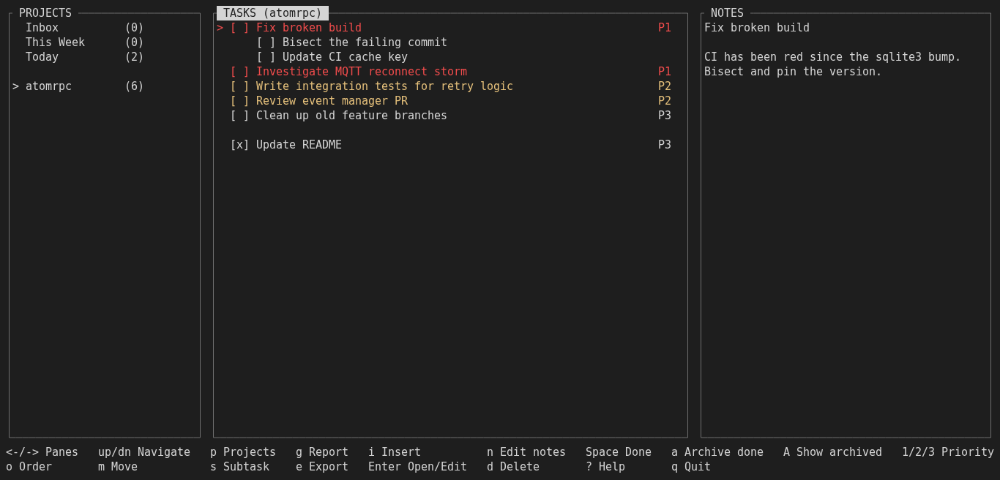
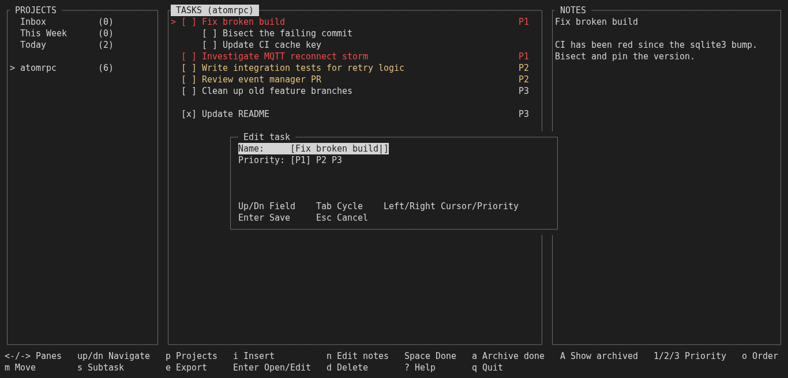
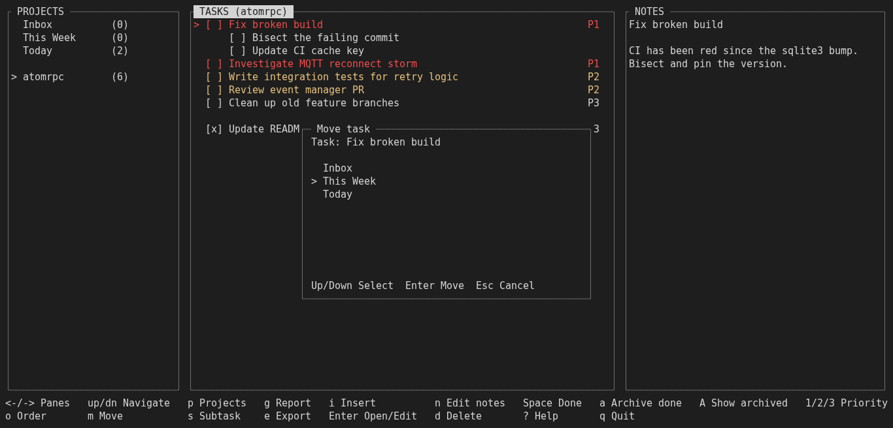
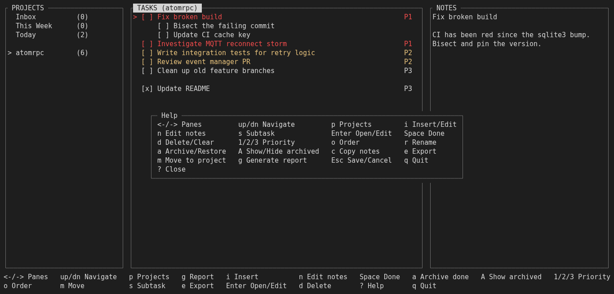

# Project-aware TODO manager for the terminal

[](https://github.com/ratkaj/terminal-todo/actions/workflows/ci.yml)
[](LICENSE)


## Why does this exist?

I used to scatter textual todo files across every project directory I worked in, then forget what I'd called them or where I'd left them — and the ones living inside a git repo meant yet another `.gitignore` entry. Browser or GUI todo apps aren't the fix either: more setup and clicking than the problem deserves. I also could not find a CLI tool to my liking. So: one SQLite file, one `todo` command that already knows which project you're standing in — built for shell-crazed geeks obsessed with TODO lists who have no intention of leaving the console.

## Screenshots

| Main view | Task form |
| --- | --- |
| [](screenshots/main-view.png) | [](screenshots/task-edit-form.png) |
| **Move task** | **Help overlay** |
| [](screenshots/move-task.png) | [](screenshots/help-overlay.png) |

The primary design priorities are:

1. Excellent terminal user experience.
2. Very fast task capture and manipulation.
3. Directory-aware project context.
4. Responsive operation in terminals of widely varying sizes.
5. Simple, maintainable architecture.
6. Reliable persistence and strong automated testing.

Avoid unnecessary features and abstractions.

## Core concept

Enter a project directory and run `todo` to work with its tasks:

```bash
cd ~/work/atomrpc
todo
```

Projects can also exist without a directory. Three are built in: `Today` and `This Week` for manually planning your days, and `Inbox` for quick capture when a task has no project yet. A task can be moved to another project later with `m`.

Tasks live in one central SQLite database, `~/.local/share/todo/todo.db`, never in project directories, so nothing ends up in your Git repositories. Running `todo` in an unregistered directory offers it as a new project, which is saved only once you add its first task.

Running `todo` from your home directory opens `Today`.

## Install

Dependencies: a C11 compiler, GNU autotools, `ncursesw`, and `sqlite3`.

```bash
# Debian/Ubuntu
sudo apt install build-essential autoconf automake pkg-config libncursesw5-dev libsqlite3-dev

# Fedora
sudo dnf install gcc autoconf automake pkgconf-pkg-config ncurses-devel sqlite-devel

# Arch
sudo pacman -S base-devel autoconf automake pkgconf ncurses sqlite
```

Then build and install:

```bash
autoreconf -i
./configure
make
make install
```

`configure` defaults to installing under `~/.local` (no sudo needed) — this is a
single-user personal tool, not something distros package. Make sure
`~/.local/bin` is on your `PATH`. Pass `--prefix=...` to override.

## Usage

```bash
cd ~/work/atomrpc   # any project directory
todo
```

Tasks start focused. A quick reference — see [docs/ui.md](docs/ui.md) for the full spec:

| Key | Action |
| --- | --- |
| `←/→`, `↑/↓` | Move between panes / navigate entries |
| `i` | Insert (new task/project) or edit notes, depending on focus |
| `r` | Rename project, or open the selected task for editing |
| `Enter` | Open the selected task/subtask; submit the open form |
| `s` | Add a subtask under the selected task (or its parent, if a subtask is selected) |
| `n` | Quick-edit the selected task's notes (hands off to `$EDITOR`) |
| `Space` | Complete/uncomplete the selected task |
| `1` / `2` / `3` | Set priority P1/P2/P3 |
| `o` | Reorder mode (`↑/↓` to move, `Enter` or `Esc` to finish) |
| `m` | Move the selected task (with its subtasks and notes) to another project |
| `a` / `A` | Archive done tasks or the selected project / show or hide archived |
| `d` | Delete or clear, depending on focus |
| `e` | Export the current project as plain text (opens read-only in `$EDITOR`) |
| `g` | Report of tasks completed this/last week or month, grouped by project (opens read-only in `$EDITOR`) |
| `c` | Copy the selected task's notes to the clipboard (Notes pane; needs a terminal with OSC 52 support) |
| `p` | Open the project switcher (type to filter) |
| `Esc` | Cancel the open form or popup |
| `?` | Help overlay with all bindings (`↑/↓` scrolls it in small windows) |
| `q` | Quit |

The hotkey footer adapts to the window width and is hidden when it would need more than three rows; `?` always shows every binding.

## Documentation

| Document | Contents |
| --- | --- |
| [Functional requirements](docs/requirements.md) | Projects, tasks, subtasks, notes, priorities, ordering, persistence, and search. |
| [Archiving and ordering](docs/archiving_and_ordering.md) | Task and project archiving, archive visibility, restoration, and state-aware ordering. |
| [User interface](docs/ui.md) | Navigation, hotkeys, colors, reorder mode, moving tasks, export, reports, responsive behavior, and template links. |
| [Development requirements](docs/development.md) | Architecture constraints, testing and code quality targets, and the AI-assisted development model. |
| [ncurses implementation notes](docs/developer/ncurses-ui.md) | Rendering, Unicode, colors, resizing, and terminal-specific pitfalls. |
| [Window templates](docs/templates/) | Layout references, starting with the [full-size main window](docs/templates/template-fullsize-main-window.md). |
| [Architecture](docs/developer/ARCHITECTURE.md) | Module breakdown, SQLite schema, and the UI state machine. |

Product specifications live in `docs/`; C coding and implementation guidance live in `docs/developer/`. See [CONTRIBUTING.md](CONTRIBUTING.md) for how the pieces fit together, including for AI coding agents.

## Non-goals

Do not implement unless requirements change:

* collaboration
* multiple users
* cloud synchronization
* calendar integration
* notifications
* attachments
* arbitrary task nesting
* complex dependency graphs
* recurring tasks
* tags
* snoozing/defer system
* elaborate workflow states
* web interface
* GUI
* plugin system
* CLI task capture (`todo add ...`) — considered and deliberately dropped; this is an interactive-ncurses-only tool

The objective is not to reproduce Todoist, Jira, or another general-purpose task manager.

The objective is a **small Linux tool optimized around one user's workflow: enter a project directory, run `todo`, and immediately work with the tasks relevant to that context.**

## Design Principle

Every proposed feature should be evaluated against:

> Does this make capturing, finding, planning, or completing my tasks meaningfully faster?

If not, leave it out.

Prefer a small application whose complete behavior can be understood over a feature-rich application that requires configuration or maintenance.

## Known limitations

* **Non-ASCII text entry**: typing accented characters, CJK, or emoji into a task or project name, or the project switcher's filter, currently drops or mangles them — input reads keys one byte at a time and doesn't yet reassemble multi-byte UTF-8 sequences. Notes are unaffected, since they are edited in `$EDITOR`. Titles containing such characters *display* correctly (see `docs/agent-lessons.md`'s follow-ups); typing them in doesn't, yet.

## License

[MIT](LICENSE) — see [`LICENSE`](LICENSE).
